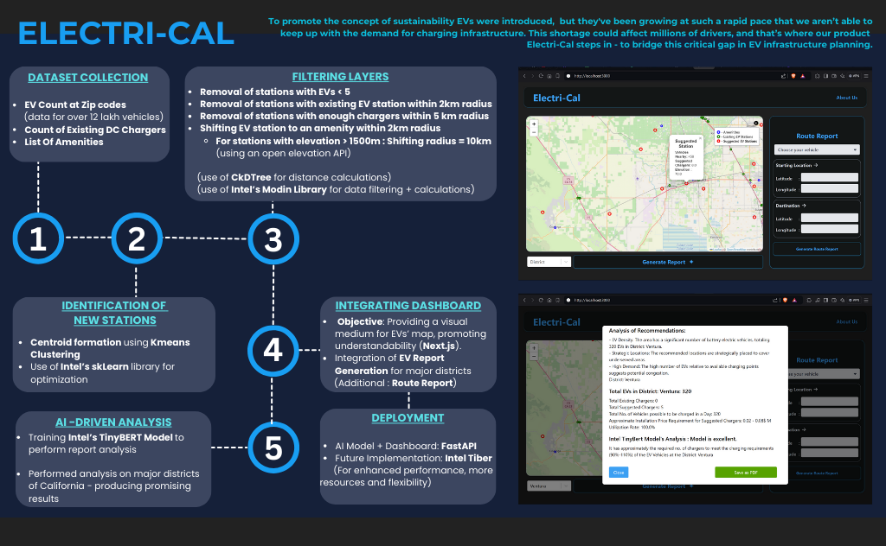

# Electri-Cal 
### Electric Vehicle Station Recommendation System

## Overview
This Python script uses K-Means clustering and spatial data analysis to recommend optimal locations for new Electric Vehicle (EV) charging stations in California. It takes into account existing EV station data, vehicle distribution patterns, and nearby amenities to suggest strategic placements that ensure accessibility for electric car owners while avoiding over-saturation.


## Key Features
1. **Data Loading and Preprocessing:**
   - Loads vehicle data from a CSV file containing latitude, longitude, and vehicle counts.
   - Filters out vehicles located outside California's northern border.
   - Creates weighted data based on vehicle counts to accurately represent demand.
   - Optionally loads existing EV station data (DC fast chargers) from a CSV file.
   - Loads nearby amenity data (e.g., parking locations) from a CSV file and builds a spatial KDTree for efficient location queries.

2. **K-Means Clustering:**
   - Performs K-Means clustering on weighted vehicle data to identify high-density vehicle areas.
   - Determines the optimal number of clusters, up to a defined limit, to ensure meaningful groupings.
   
3. **EV Station Recommendation:**
   - Analyzes each cluster's vehicle count to assess the need for additional charging infrastructure.
   - Checks for existing EV stations within a specific exclusion radius around each cluster centroid to prevent over-saturation.
   - Calculates the required number of chargers based on the cluster’s vehicle count.
   - Identifies nearby amenities (e.g., parking locations) and suggests shifting the EV station location to the nearest amenity for better accessibility.
   - If no nearby amenities are found, the original centroid location is used for the EV station.
   - If a recommended location falls within a region with elevation ≥1500km, it is shifted to the nearest amenity within a 10km radius.

4. **Visualization and Output:**
   - Generates a Folium map centered on California, showing:
     - Existing EV stations (if data is available).
     - Suggested EV station locations with appropriate markers and popups displaying the estimated number of required chargers.
   - Saves the generated map as an HTML file (`latestEVPlot.html`).
   - Prints the total execution time and the number of successful recommendations made for new EV stations.
5. **Dashboard Features:**
   - Interactive Map:
     - Displays suggested, existing charging stations, and amenities.
   - Report Generation:
     - Button to generate reports about how suggested chargers in a particular pincode optimize EV charging stations using Dynamic TinyBert Model.
   - Travel Metrics Analysis:
     - Provides details on battery consumption, travel time, battery level, and distance based on the EV model and specified locations.

## Benefits
This script helps address the growing demand for EV charging infrastructure in California by recommending data-driven, geographically optimized locations for new EV charging stations. It ensures accessibility by factoring in vehicle distribution patterns and leveraging existing amenities such as parking lots.

## Dependencies
The following Python libraries are required:
- `pandas`
- `numpy`
- `folium`
- `scikit-learn`
- `scipy`
- `pytorch`
- `transformers`
-  `fastapi`
-  `geopy`
- `modin[all]`
- `requests`
- `ray`

Install these libraries using `pip`:
```bash
pip install pandas numpy folium scikit-learn scipy pytoch transformers fastapi geopy modin[all] requests ray 
```

## Usage Instructions
1. Clone or download this repository.
2. Place the following CSV files in the same directory as the script:
   - `merged_evDatawithZip.csv`: Vehicle data with latitude, longitude, and vehicle counts (Mandatory).
   - `dc_fast_charger_data.csv`: Existing EV station data with location and charger count information (Optional, but recommended).
   - `filtered_parking_locations.csv`: Amenity data with location information (Optional, but recommended for improved recommendations).
3. Run the script using a Python interpreter:
   ```bash
   python ev_station_recommendation.py
   ```
4. After execution, an HTML file (`latestEVPlot.html`) will be generated that visualizes the recommended EV station locations.

## Future Enhancements
- **Real-Time Data Integration:** Incorporate real-time traffic data to dynamically adjust for vehicle distribution patterns.
- **Proximity to Infrastructure:** Consider additional factors such as proximity to highways, public transportation hubs, and commercial centers for more strategic station placement.
- **Energy Grid Considerations:** Integrate energy grid capacity data to ensure that new stations are placed in areas where sufficient power is available.
- **User Interface:** Develop an interactive user interface for visualizing and exploring recommended EV stations.

---

## Contact
For any questions or contributions, please reach out at [pranay.rajvanshi@gmail.com] [parthratra11@gmail.com].
